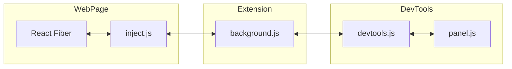
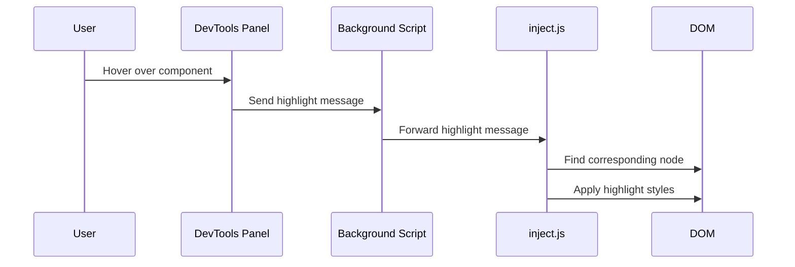
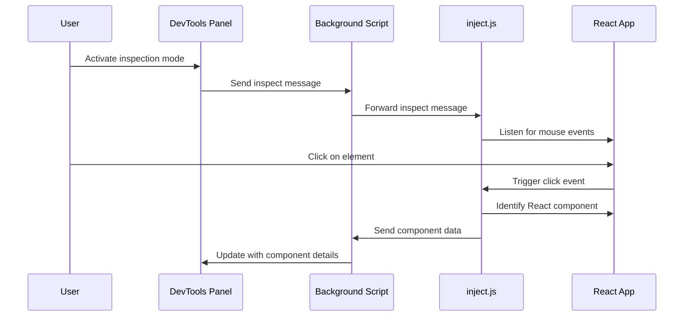
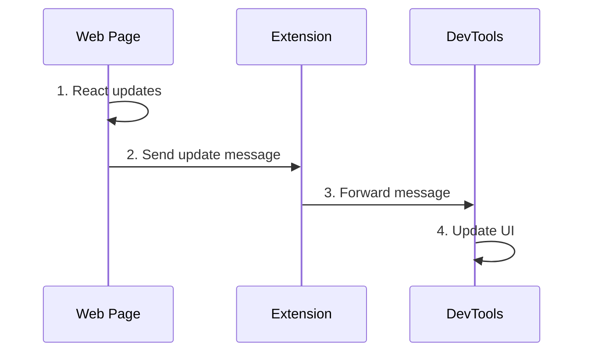
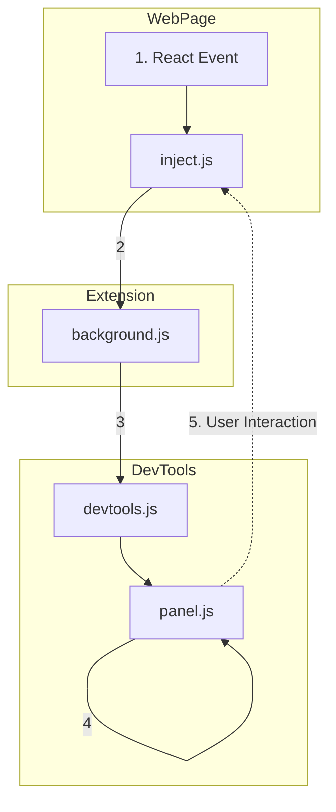
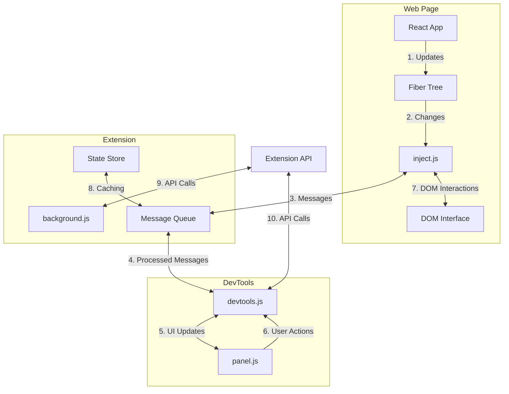

# Minimal React DevTools

## Project Overview

Minimal React DevTools is a lightweight, hackable Chrome extension designed to provide essential React debugging capabilities. It offers a streamlined interface for inspecting React component hierarchies and state, serving as both a useful tool and an excellent starting point for custom DevTools development.

### Why Minimal React DevTools?

1. **Lightweight Alternative**: Provides core functionality with minimal overhead, ideal for performance-sensitive scenarios.

2. **Coexistence with Official DevTools**: Can run alongside the official React DevTools without conflicts.

3. **Focus on Essential Features**: Offers a simpler, more intuitive interface for common debugging tasks.

4. **Performance Optimization**: Designed with performance in mind, suitable for large-scale React applications.

5. **Educational Tool**: Serves as a learning resource for understanding React debugging internals.

6. **Hackable and Extensible**: Built to be forked, modified, and extended by the community.

### Fork, Hack, and Build!

We strongly encourage developers to fork this project and use it as a foundation for building custom React debugging tools. Here's why:

- **Simplified Codebase**: Easy to understand and modify, perfect for experimentation.
- **Modular Design**: Add new features or modify existing ones with minimal friction.
- **Learning Opportunity**: Ideal for developers looking to deep-dive into browser extension development or React internals.
- **Custom Tooling**: Tailor the DevTools to your specific project needs or workflow.

#### Ideas for Extensions:

- Add support for your favorite state management library
- Implement custom visualization for your app's component structure
- Create specialized debugging features for your team's common pain points
- Integrate with your favorite LLM tooling.

### Comparison with Official React DevTools

| Feature | Minimal React DevTools | Official React DevTools |
|---------|------------------------|--------------------------|
| Component Tree Inspection | ✅ | ✅ |
| Props and State Viewing | ✅ | ✅ |
| Component Highlighting | ✅ | ✅ |
| Performance Impact | Low | Moderate |
| Advanced Profiling | ❌ | ✅ |
| Hook Inspection | Basic | Advanced |
| Can Run Alongside Other Versions | ✅ | ❌ |
| Easily Hackable | ✅ | ❌ |

### When to Use Minimal React DevTools

- As a starting point for custom React debugging tools
- When working on performance-sensitive applications
- In environments where the official DevTools cause conflicts
- For quick, focused debugging sessions
- As a learning tool for understanding React internals
- When a lighter, less feature-heavy tool is preferred

Minimal React DevTools complements the React development ecosystem by providing a streamlined, hackable alternative to the official DevTools. Whether you're using it as-is, or as a foundation for your own custom tooling, we hope it enhances your React development experience.

## Basic Component Diagram



## Component Descriptions

1. **inject.js**:
   - Injected into the web page
   - Interacts directly with React internals
   - Serializes Fiber tree for transmission
   - Handles component highlighting and selection

2. **background.js**:
   - Manages the extension's background processes
   - Handles message routing between content script and DevTools

3. **devtools.js**:
   - Initializes the DevTools panel
   - Sets up communication channel with background.js
   - Manages DevTools-specific functionality

4. **panel.js**:
   - Implements the UI of the custom DevTools panel
   - Renders component tree and details
   - Sends user interactions back through the extension

## React Fiber Representation and Component Interaction

### Fiber Tree Structure

The extension interacts with React's internal Fiber tree, which represents the component hierarchy. Each Fiber node contains:

- Tag (indicating component type)
- Key
- Element type
- Component type
- State node (DOM node for host components)
- Child and sibling references

### Serialization

The Fiber tree is serialized in `inject.js` to create a lightweight representation:

```javascript
function serializeFiber(fiber, depth = 0) {
  if (!fiber || depth > 50) return null;
  return {
    tag: fiber.tag,
    key: fiber.key,
    elementType: fiber.elementType ? (typeof fiber.elementType === 'string' ? fiber.elementType : fiber.elementType.name || String(fiber.elementType)) : null,
    type: fiber.type ? (typeof fiber.type === 'string' ? fiber.type : fiber.type.name || String(fiber.type)) : null,
    stateNode: fiber.stateNode ? (fiber.stateNode.nodeType ? fiber.stateNode.nodeName : 'NonDOMNode') : null,
    child: serializeFiber(fiber.child, depth + 1),
    sibling: serializeFiber(fiber.sibling, depth),
  };
}
```

### Component Highlighting

Highlighting process:



### Component Selection

Selection for inspection:



## Installation

1. Clone this repository:
   ```
   git clone https://github.com/tmc/minimal-react-devtools.git
   ```
2. Open Chrome and navigate to `chrome://extensions/`
3. Enable "Developer mode" in the top right corner
4. Click "Load unpacked" and select the cloned repository folder

## Usage

1. Open DevTools in a web page running a React application
2. Navigate to the "Minimal React" panel
3. Use the component tree to inspect React elements
4. Click on components to view their props and state
5. Use the inspect button to select components directly from the page

## Testing

Run the automated tests:

```
make test
```

For debugging tests with additional logging:

```
make debug-test
```

## Detailed Architecture and Message Passing

### Basic Message Flow

Let's start with a simple overview of how messages flow between the main components:



This basic flow shows the high-level interaction between the three main parts of our system:
1. The Web Page, where React updates occur
2. The Extension, which acts as an intermediary
3. The DevTools, where the UI is updated to reflect changes

### Intermediate Message Flow

Now, let's look at a more detailed view of how messages flow, including the specific components involved:



This intermediate flow provides more detail:
1. React events in the Web Page trigger updates
2. `inject.js` captures these updates and sends them to the Extension
3. `background.js` in the Extension forwards messages to the DevTools
4. `devtools.js` receives messages and updates `panel.js`
5. User interactions in `panel.js` can trigger messages back to `inject.js`

### Advanced Message and Data Flow

For a more comprehensive view of the system, including data stores and APIs, let's examine this advanced diagram:



This advanced flow illustrates several key aspects of the system:

1. The React App updates its Fiber Tree, which represents the component hierarchy.
2. `inject.js` observes changes in the Fiber Tree and serializes them.
3. Messages are sent to and from the Extension's Message Queue, which helps manage asynchronous communication.
4. The DevTools scripts process these messages and update the UI accordingly.
5. User actions in the DevTools panel can trigger messages back through the system.
6. The DOM Interface allows for direct manipulation of the webpage for features like highlighting components.
7. A State Store in the Extension helps cache data for improved performance.
8. The Extension API provides a bridge to Chrome's extension capabilities, used by both background and DevTools scripts.

This diagram showcases the cyclical nature of data flow in the extension, with information constantly moving between the React application, the extension's background processes, and the DevTools UI.

## Contributing

1. Fork the repository
2. Create a new branch for your feature
3. Make your changes and commit them
4. Push to your fork and submit a pull request

Please ensure that your code adheres to the existing style and passes all tests before submitting a pull request.
