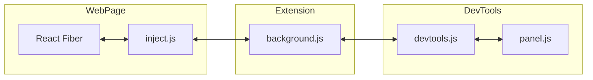
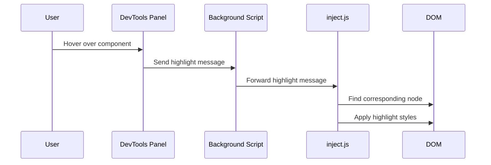
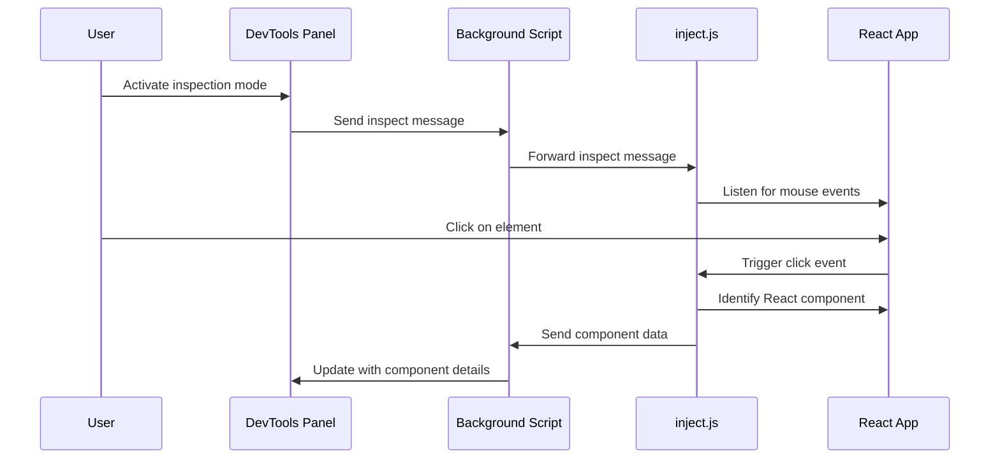
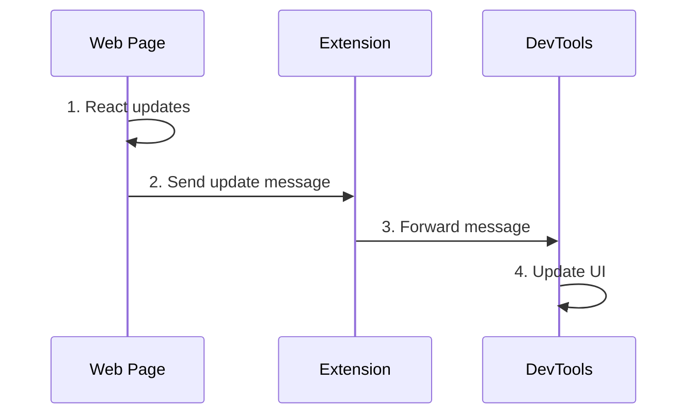
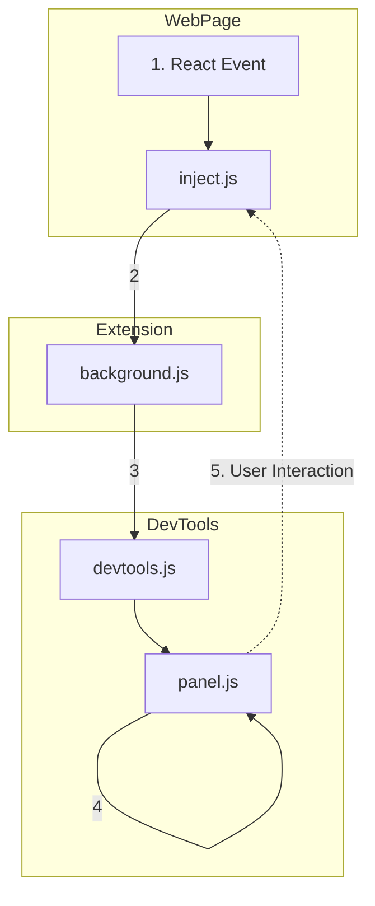
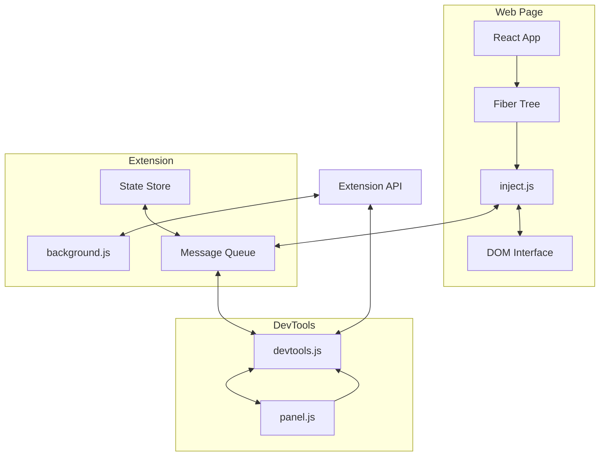

# Minimal React DevTools

## Project Overview
Minimal React DevTools is a lightweight Chrome extension that provides essential React debugging capabilities without interfering with the official React DevTools. It offers a streamlined interface for inspecting React component hierarchies and state.

## Basic Component Diagram



## Component Descriptions

1. **inject.js**:
   - Injected into the web page
   - Interacts directly with React internals
   - Serializes Fiber tree for transmission
   - Handles component highlighting and selection

2. **background.js**:
   - Manages the extension's background processes
   - Handles message routing between content script and DevTools

3. **devtools.js**:
   - Initializes the DevTools panel
   - Sets up communication channel with background.js
   - Manages DevTools-specific functionality

4. **panel.js**:
   - Implements the UI of the custom DevTools panel
   - Renders component tree and details
   - Sends user interactions back through the extension

## React Fiber Representation and Component Interaction

### Fiber Tree Structure

The extension interacts with React's internal Fiber tree, which represents the component hierarchy. Each Fiber node contains:

- Tag (indicating component type)
- Key
- Element type
- Component type
- State node (DOM node for host components)
- Child and sibling references

### Serialization

The Fiber tree is serialized in `inject.js` to create a lightweight representation:

```javascript
function serializeFiber(fiber, depth = 0) {
  if (!fiber || depth > 50) return null;
  return {
    tag: fiber.tag,
    key: fiber.key,
    elementType: fiber.elementType ? (typeof fiber.elementType === 'string' ? fiber.elementType : fiber.elementType.name || String(fiber.elementType)) : null,
    type: fiber.type ? (typeof fiber.type === 'string' ? fiber.type : fiber.type.name || String(fiber.type)) : null,
    stateNode: fiber.stateNode ? (fiber.stateNode.nodeType ? fiber.stateNode.nodeName : 'NonDOMNode') : null,
    child: serializeFiber(fiber.child, depth + 1),
    sibling: serializeFiber(fiber.sibling, depth),
  };
}
```

### Component Highlighting

Highlighting process:



### Component Selection

Selection for inspection:



## Installation

1. Clone this repository:
   ```
   git clone https://github.com/tmc/minimal-react-devtools.git
   ```
2. Open Chrome and navigate to `chrome://extensions/`
3. Enable "Developer mode" in the top right corner
4. Click "Load unpacked" and select the cloned repository folder

## Usage

1. Open DevTools in a web page running a React application
2. Navigate to the "Minimal React" panel
3. Use the component tree to inspect React elements
4. Click on components to view their props and state
5. Use the inspect button to select components directly from the page

## Testing

Run the automated tests:

```
make test
```

For debugging tests with additional logging:

```
make debug-test
```

## Detailed Architecture and Message Passing

### Basic Message Flow



### Intermediate Message Flow



### Slightly More Advanced Message Flow



## Contributing

1. Fork the repository
2. Create a new branch for your feature
3. Make your changes and commit them
4. Push to your fork and submit a pull request

Please ensure that your code adheres to the existing style and passes all tests before submitting a pull request.
